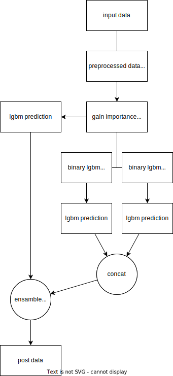

# SIGNATE STUDENT CUP 2023 secondhand car prediction

## data info

| Index | Column        | Non-null Count| Data Type | note                 |
|-------|---------------|---------------|-----------|----------------------|
| 0     | region        | 27532         | object    |where sell car        |
| 1     | year          | 27532         | int64     |when car made         |
| 2     | manufacturer  | 27532         | object    |campany name          |
| 3     | condition     | 27532         | object    |excellent, fair, good, like new, salvage, new|
| 4     | cylinders     | 27532         | object    |can convert int       |
| 5     | fuel          | 26293         | object    |gas, nan, diesel, other, hybrid, electric|
| 6     | odometer      | 27532         | int64     |how long drive        |
| 7     | title_status  | 27076         | object    |clean, rebuilt, parts only, salvage, missing, lien|
| 8     | transmission  | 27532         | object    |manual, automatic,    |
| 9     | drive         | 27532         | object    |rwd, fwd, 4wd         |
| 10    | size          | 27532         | object    |car size              |
| 11    | type          | 27076         | object    |car type              |
| 12    | paint_color   | 27532         | object    |car color             |
| 13    | state         | 24228         | object    |sell in state         |


### category

| Category       |Category length|
|----------------|---------------|
| region         | 372           |
| manufacturer   | 125           |
| condition      | 6             |
| fuel           | 6             |
| title_status   | 7             |
| transmission   | 3             |
| drive          | 3             |
| size           | 9             |
| type           | 14            |
| paint_color    | 12            |
| state          | 52            |

### missing values
train data:

| feature       | missing value |
|---------------|---------------|
| year          | 4             |
| manufacturer  | 1081          |
| cylinders     | 71            |
| fuel          | 1239          |
| odometer      | 264           |
| title_status  | 456           |
| type          | 456           |
| state         | 3304          |

test data:

| feature       | missing value |
|---------------|---------------|
| year          | 3             |
| manufacturer  | 1028          |
| cylinders     | 78            |
| fuel          | 1495          |
| odometer      | 124           |
| title_status  | 229           |
| type          | 229           |
| state         | 3029          |

## data analysis
- I/O: 14 feature(include 11 object, 3 integer) -> 1 float  
- huristic soluiton: 612 float -> 1 float  
- (behind of: test and train are using same categolize feature)  
- train: 27532 instance  
- test: 27537 instance  

- max(train.year) = 3017  
- min(train.odometer) = -131869.0  
- condition: new, like new and title_status: salvage is not match  


## knowlage

- Cities are more expensive than rural areas
- Black, white cars are more popular than other colors
- Think threshold of odometer
- Condition is more subjective than odmeter[[1]](https://www.investopedia.com/articles/investing/090314/just-what-factors-value-your-used-car.asp)
- location × type[[1]](https://www.investopedia.com/articles/investing/090314/just-what-factors-value-your-used-car.asp)
- most important feature is odometer and condition[[1]](https://www.investopedia.com/articles/investing/090314/just-what-factors-value-your-used-car.asp)
- have to care a collectible or a classic car [[2]](https://www.capitalone.com/cars/learn/managing-your-money-wisely/factors-that-can-affect-used-car-tradein-value/1224)
-  A model that sold poorly or a make that's gone out of business could be at a disadvantage. [[2]](https://www.capitalone.com/cars/learn/managing-your-money-wisely/factors-that-can-affect-used-car-tradein-value/1224)
- The Manheim Used Vehicle Value Index clearly illustrates the relationship between economic activity and used-vehicle pricing [[3]](https://www.moneycrashers.com/factors-affect-used-cars-resale-value/)
- Sports cars and convertibles sell better in warm climates, where they’re practical throughout the year. [[3]](https://www.moneycrashers.com/factors-affect-used-cars-resale-value/)
- Rugged SUVs and four-wheel-drive vehicles are more popular in colder climates and areas with rougher terrain. [[3]](https://www.moneycrashers.com/factors-affect-used-cars-resale-value/)
- paint color × type [[3]](https://www.moneycrashers.com/factors-affect-used-cars-resale-value/)
- Company owned cars often fetch a lower price as multiple employees and chauffeurs may have handled the car, leading to an undesirable level of maintenance. [[4]](https://www.truebil.com/blog/7-factors-that-influence-the-price-of-a-used-car/)
- drive:4wd is outdoor activity, so it is more popular in rural areas
- car age = current year - year
- type × drive
- cylinder is other not meaning contain 4, 6, 8, 10, 12(eg. id=16 car have 4 or 6 cylinders)


## note
- trust cv score
- LB socre is evaluated with about 50% of test data
- result score is evaluated with about 50% of test data(residuals)
- mape is sensitive to outliers score

## process flow



## usage

   ```
   $ python [model name].py
   ```
model name is below.

## model

- Light GBM as: optuna_lgbm, lgbm2lgbm, lgbm4highprice
> not nessesary to fill missing value  
> main model

- kNearestNeighbor as: knn, lgbm2knn
> nessesary to fill missing value
> for ensamble

- TabNet: as: tabnet, pretrain_tabnet
> nessesary to fill missing value  
> for ensamble


## results structure

```
.
└── MODELNAME_MMDDHHMM
    ├── experiment_description.md
    ├── lib/: use to main script
    ├── main.py: main script
    ├── eval[0-4].csv: use to ensamble score calucrate
    ├── estimater[0-4].pkl: preprocessor&model pickle, use to predict
    ├── importance[0-4].csv: feature importance from lgbm, tabnet
    ├── submission_foldensamble.csv: submit file (fold ensambled)
    └── submission.csv: submit file (best score model)
```


## submit log

id | submit date | LB SCORE   | CV SCORE   | model name     | note
---|-------------|------------|------------|----------------|---------------------
00 | 00/00       | ---------- | ---------  | model name     | note-sample
01 | 07/24       | 74.1591418 | ---        | linear reg     | baseline
02 | 07/25       | 64.4725457 | ---        | lightgbm       | baseline
03 | 07/25       | 93.0489719 | ---        | kNN            | baseline
04 | 07/25       | 64.8894607 | ---        | optunalgbm     | baseline
05 | 07/25       | 63.9816542 | 0.6718754  | optunalgbm     | mape
06 | 07/25       | 63.9530481 | 0.6726030  | optunalgbm     | year preprocess
07 | 07/26       | 54.7203297 | 0.5826630  | tabnet         | baseline
08 | 07/26       | 65.0083427 | 0.6626362  | optunalgbm     | preprocess
09 | 07/26       | 65.0047198 | 0.6653598  | optunalgbm     | manufacturer convert
10 | 07/26       | 50.3306512 | ---        | ensamble       | tabnet & lgbm & knn
11 | 07/27       | 57.1164467 | 0.4916165  | ensamble       | tabnet & lgbm
12 | 07/27       | 46.3171088 | 0.6603588  | ensamble       | 07271715
13 | 07/27       | 43.9966495 | 0.4484893  | lgbm           | metric = mape
14 | 07/27       | 58.0910980 | 0.5867500  | ensamble       | lgbm & knn
15 | 07/28       | 52.6076171 | 0.5389053  | optunatabnet   | baseline
16 | 07/28       | 51.1907972 | 0.6442794  | ensamble       | tabnet & lgbm & knn
17 | 07/29       | 43.9883538 | 0.4482073  | lgbm           | odometer 0.95->0.999
18 | 07/30       | 52.8993538 | 0.5526269  | optunatabnet   | odometer 0.95->0.999
19 | 07/30       | 44.5276972 | 0.4537431  | lgbm2lgbm      | head 20
20 | 07/30       | 43.8852558 | 0.4484495  | lgbm2lgbm      | head 100
21 | 07/31       | 44.4613465 | 0.4531333  | lgbm           | pibot feature = 10
22 | 07/31       | 45.0679902 | 0.4571785  | lgbm2lgbm      | pibot feature = 5
23 | 07/31       | 44.2930607 | 0.4506372  | lgbm2lgbm      | head 150
24 | 07/31       | 56.6929139 | 0.5749856  | tabnet         | pibot feature = 10
25 | 07/31       | 61.8899541 | 0.5854288  | tabnet         | T_max = 50
26 | 08/01       | 77.5728960 | 0.7718511  | pretraintabnet | baseline
27 | 08/01       | 50.6988354 | 0.5024832  | tabnet         | metric:mape
28 | 08/01       | 77.8566713 | 0.7748640  | pretraintabnet | metric:mape
29 | 08/01       | 53.3238836 | 0.5531670  | tabnet         | to get importance
30 | 08/02       | 43.9283093 | 0.4482270  | lgbm           | fill state with region
   |             |            |            |                | target encoding
31 | 08/02       | 54.1795198 | 0.5417684  | tabnet         | target encoding
32 | 08/02       | 43.8377711 | 0.4478669  | lgbm           | target encoding
33 | 08/02       | 44.1760283 | 0.4476203  | lgbm2lgbm      | target encoding
33 | 08/02       | 59.2623083 | 0.5978083  | pretraintabnet | target encoding
   |             |            |            |                | implement kFold(k=5)
34 | 08/03       | 50.6851282 | 0.4988996  | lgbm           | k=5Fold
35 | 08/03       | 50.8064319 | 0.5039760  | lgbm           | k=5Fold same ppr using
36 | 08/03       | 45.1808372 | 0.4509851  | lgbm           | using same feature as train
37 | 08/03       | 44.9523946 | 0.4516849  | lgbm2lgbm      | using same feature as train kFold
38 | 08/04       | 51.7744437 | 0.5498375  | pretraintabnet | using same feature as train kFold
39 | 08/04       | 46.0678627 |    ---     | ensamble       | tabnet, pretraintabnet, lgbm, lgbm2lgbm
40 | 08/04       | 46.3248589 |    ---     | ensamble       | knn, tabnet, pretraintabnet, lgbm, lgbm2lgbm
41 | 08/05       | 45.0391824 | 0.4509864  | lgbm           | new&salvage = salvage
42 | 08/05       | 44.9588989 | 0.4504986  | lgbm2lgbm      | new&salvage = salvage
43 | 08/05       | 54.8555521 | 0.5455362  | tabnet         | new&salvage = salvage, MinMaxScaler
   |             |            |            |                | year-100 -> year-1000
44 | 08/06       | 45.0624852 | 0.4506018  | lgbm           | odometer x//10(if x > 1e+6)
45 | 08/06       | 44.4072212 | 0.4468764  | lgbm2lgbm      | odometer *-1(if x < -1)
46 | 08/06       | 45.0414067 | 0.4506018  | lgbm     　　　| implement odometerperyear, log-odometer
47 | 08/06       | 93.2438199 | 0.9629056  | knn            | implement odometerperyear, log-odometer
48 | 08/06       | 50.0625215 | 0.6979528  | ensamble       | lgbm, lgbm2lgbm, knn
49 | 08/07       | 44.9341699 | 0.4508450  | lgbm           | target /= year
50 | 08/07       | 45.0695367 | 0.4508899  | lgbm2lgbm      | target /= year
51 | 08/08       | 47.7411234 | 0.4790775  | lgbm           | (likenew|new)&salvage = salvage, num_boost_round=100
52 | 08/08       | 45.1319448 | 0.4520236  | lgbm           | num_boost_round=500, fill odometer with liner regression(not good solution)
54 | 08/08       | 43.9055821 | 0.4447198  | lgbm           | size2score
54 | 08/08       | 44.1621836 | 0.4466397  | lgbm           | label encoding
55 | 08/08       |     ---    | 0.4460151  | lgbm           | num_boost_round=1000
56 | 08/08       |     ---    | 0.4464472  | lgbm           | num_boost_round=1500, state fill with region
57 | 08/08       |     ---    | 0.4463739  | lgbm           | num_boost_round=1000
58 | 08/08       | 44.0173306 | 0.4457824  | lgbm           | fill na odometer with linear regression(limit:max)
59 | 08/09       | 44.0654083 | 0.4458878  | lgbm           | num_boost_round=1200
60 | 08/09       |     ---    | 0.4464012  | lgbm           | num_boost_round=1200, learning_rate=0.005
61 | 08/09       | 44.4504667 | 0.4480120  | lgbm           | fill na odometer with linear regression(limitrange:min,max),del learning rate
62 | 08/09       |     ---    | 0.4486245  | lgbm           | num_boost_round=1500
63 | 08/09       | 44.2078102 | 0.4475404  | lgbm           | num_boost_round=1000, limit range:min, quantile(0.95)
64 | 08/09       |     ---    | 0.4483642  | lgbm           | when title_status & type isna labeled "dropped", cylinders type -> float
65 | 08/09       | 44.4327305 | 0.4476135  | lgbm           | when title_status & type isna labeled "dropped" cancel
66 | 08/12       | 44.1795370 | 0.4452962  | lgbm           | one-hot-encoding
67 | 08/12       |     ---    | 0.4460732  | lgbm           | fill cylinders with median(type&size), fill fuel with median(manufacturer)
68 | 08/13       | 44.2924151 | 0.4467850  | lgbm           | fix one-hot-encoding
69 | 08/13       | 47.4934541 | 0.4783129  | lgbm           | label-encoding
70 | 08/13       | 44.0337609 | 0.4445032  | lgbm2lgbm      | one-hot-encoding
71 | 08/14       | 44.0846320 | 0.4448613  | lgbm2lgbm      | importance head 150(before 100)
   |             |            |            |                | submitting fold-ensamble
72 | 08/16       | 43.8162635 | 0.4444584  | lgbm2lgbm      | -
73 | 08/16       | 43.8523531 | 0.4445472  | lgbm2lgbm      | fix str normalize
74 | 08/16       | 43.8162635 | 0.4447255  | lgbm2lgbm      | importance head 120
75 | 08/16       | 43.8612941 | 0.4446007  | lgbm2lgbm      | early stopping at 200, num_boost_round=1200
76 | 08/16       |     ---    | 0.4447711  | lgbm2lgbm      | ref to [6] --numboostround=10000, early_stopping_rounds=250, rm lr
77 | 08/17       | 43.8085927 | 0.4446848  | lgbm2lgbm      | target=price, ref to [6] --add lr = [0.005] * 200 + [0.001] * 9800
78 | 08/17       |     --- 	| 0.4448767  | lgbm2lgbm      | first lgbm num_boost_round=10000,...
79 | 08/17       |     --- 	| 0.4457822  | lgbm2lgbm      | lr = lambda i: 0.1 - 0.00001 * i
80 | 08/17       |     --- 	| 0.4458631  | lgbm2lgbm      | lr = lambda i: 0.1 - 0.000001 * i
81 | 08/17       | 43.8359434 | 0.4447218  | lgbm2lgbm      | score_by="median"
82 | 08/19       | 43.7852075	| 0.4445914  | lgbm2lgbm      | use region, importance head 150 submitting fold ensamble
83 | 08/19       | 43.7805907 | 0.4445914  | lgbm2lgbm      | use region, importance head 150 submitting all ensamble
84 | 08/19       | 43.7960556	| 0.4443935  | lgbm2lgbm      | importance head 200
85 | 08/19       |     --- 	| 0.4446966  | lgbm2lgbm      | importance head 250
86 | 08/20       | 43.7980880 | 0.4446966  | lgbm2lgbm      | importance head 220
87 | 08/20       |     ---    | 0.4444636  | lgbm2lgbm      | importance head 180
88 | 08/21       | 44.0113334 | 0.4440190  | lgbm2lgbm4highprice | baseline
89 | 08/21       | 43.9051374 | 0.4459576  | lgbm2lgbm4highprice |high price threshold = 4e+4
90 | 08/24       | 43.6940547 |    ---     | ensamble       | lgbm2lgbm & lgbm2lgbm4highprice * 2

 finaly result is 101th place ><

## reference

### domain knowledge
[1] https://www.investopedia.com/articles/investing/090314/just-what-factors-value-your-used-car.asp  

[2] https://www.capitalone.com/cars/learn/managing-your-money-wisely/factors-that-can-affect-used-car-tradein-value/1224  

[3] https://www.moneycrashers.com/factors-affect-used-cars-resale-value/  

[4] https://www.truebil.com/blog/7-factors-that-influence-the-price-of-a-used-car/  

### library
[5] https://github.com/dreamquark-ai/tabnet#model-parameters  

[6] https://www.kaggle.com/code/bjoernholzhauer/lightgbm-tuning-with-optuna

## appendix

### data/addtional_data info
- feature_handle_dict.pkl is a dictionary that contains {feature: high price category}
- locations.pkl is made by fujii
- region.csv is made by fujii, contain region2state data
- manufacture2country_dict.pkl is manufacuture to country dictionary
- size_sort_dict.pkl is size to sort dictionary(1-4)
- state_code_dict.pkl is state to code(2-string) dictionary

### assets
- odometer_group is pandas.DataFrame["odometer"].groupby object
- price_scatter is heatmap(two pandas.Series(astype=object), value=price)
- size_scatter is heatmap(two pandas.Series(astype=object), value=count)